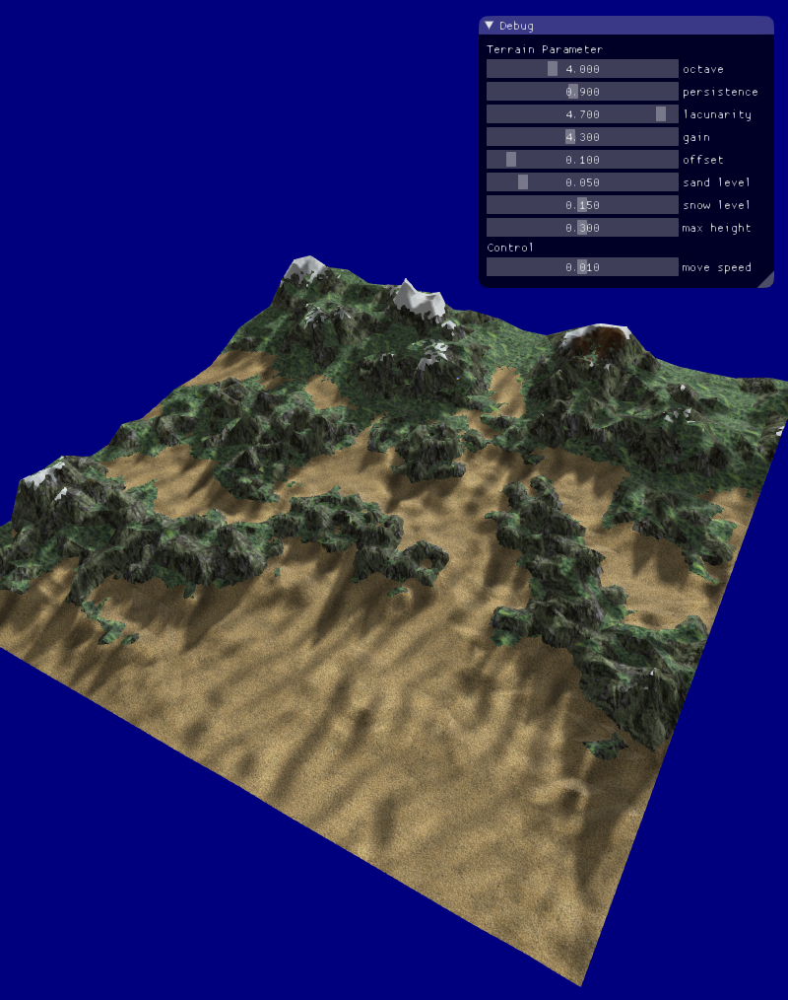
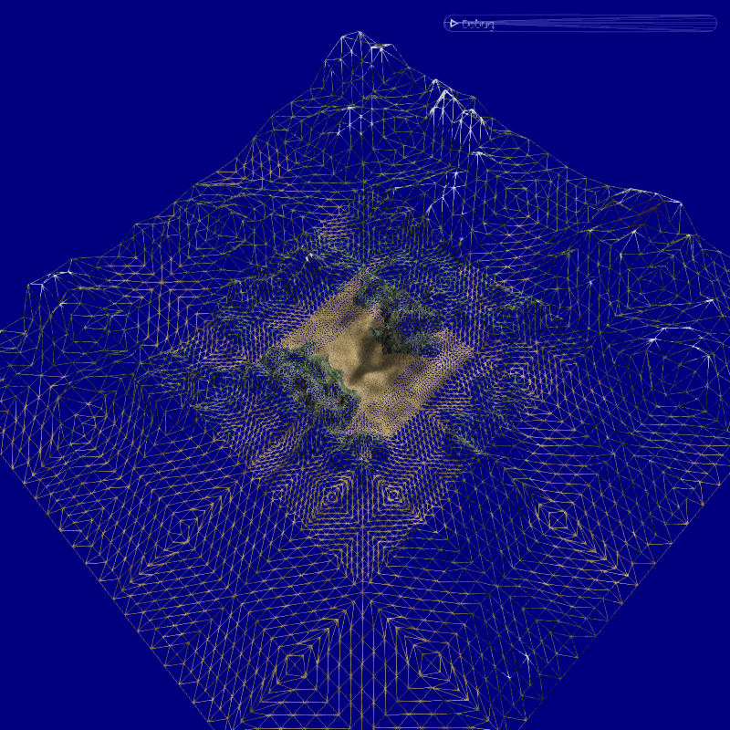

# TerrainViewer

This is a procedural terrain rendering program using fractal Brownian Motion (fBm)

## Implemented Features

* GPU procedural terrain generated using fBm and Perlin noise. 
* Soft shadow using Possion sampling
* Reflective water effect (see epfl-2015-submit branch)
* Tessellated LOD (Geometry LOD)
* Texture LOD

## Screen Shots

## Implementation (To be completed)
